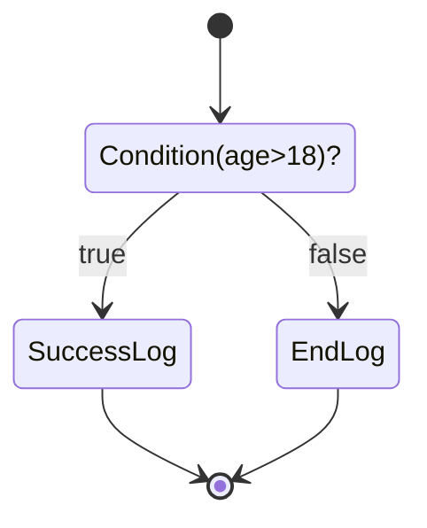

# Flow Research (Monorepo)

## Approach

- Code base node
- Flow = construct multiple node -> webpack -> script

## Instalation

- yarn

## Commands

- Build: `yarn run lerna run build`
- Test: `yarn run lerna run test`

## Packages

- node-if: `eva({mongodb query syntax}) ? TrueNode : FailedNode`
- node-log: `console.log(x)`
- types: Typedef

## Demo

Implement flow [img](example/builder/doc/img.svg) by composite `node-x`

- Builder: example/builder => Webpack bundler => standalone script
- Runner: example/runner

## Research

Some research related to node VM
